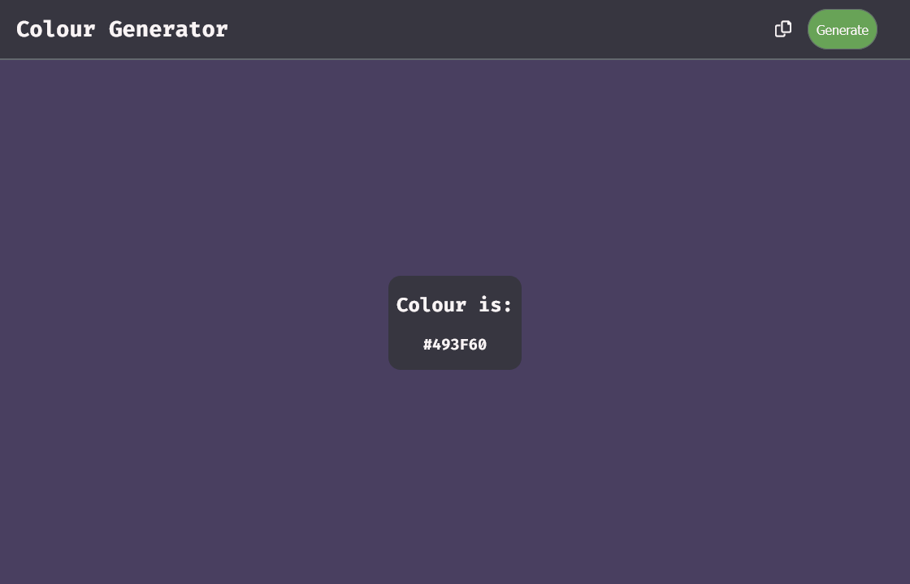

# Random Colour Generator 

My first Project using HTML, CSS & JS.

## Description

A website which creates a random colour(HEX code) and changes the background to the generated colour.
also has a copy to clipboard

My first solo project.

## Screenshot

## Links

wip

## Authors

[ LinkedIn](https://www.linkedin.com/in/john-csm-tate/)
